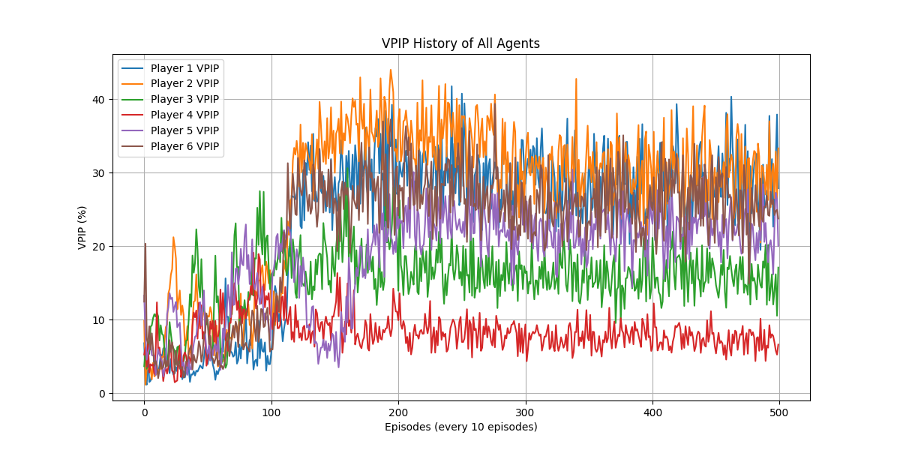

# Poker Reinforcement Learning Agents

This machine learning project is designed to uncover optimal strategies for playing poker, with a primary focus on Texas Hold'em—the most popular variant of the game. The project aims to bridge the gap between theoretical machine learning algorithms and their practical applications in game theory and decision-making under uncertainty.

## Project Overview

The objective of this project is to develop a robust AI poker player capable of competing against human players and other AI opponents. By leveraging hand-crafted feature extraction, state-of-the-art machine learning models, and rigorous training/testing procedures, this project delves deep into the complex and fascinating world of poker strategy.

The repository is organized into several vital components:

- `Models/`: Contains the trained machine learning models.
- `my_players/`: Houses the bot logic and decision-making algorithms.

## Features

- **Advanced Feature Extraction**: A sophisticated system for processing the game state, distilling vital information such as normalized stack sizes, hole card strengths, and pot sizes to inform AI decisions.
- **Machine Learning Integration**: Machine learning models developed with PyTorch are integrated to determine the best course of action given the current game situation.
- **Optimized Strategy**: Through rigorous training, the AI players adjust their strategies to maximize expected value and adopt the most effective tactics against a wide range of opponents.
- **Simulated Testing Environment**: Comprehensive testing frameworks to evaluate AI performance against various playstyles and scenarios.
  

# VPIP of DQN Agents in a 6-max 100BB Cash Game

## Further Work

The field of AI in poker is continuously evolving. Future directions of this project may include the implementation of reinforcement learning techniques, analysis of multi-player scenarios, and real-time adaptation algorithms.

## Authors

- **Trevor Poon** - _Initial work_

## Acknowledgments

A special thanks to the PyPokerEngine team for providing a robust framework that facilitates poker game simulations. Their work has been invaluable in the development of this project.

For any inquiries or suggestions, please open an issue in this repository or reach out directly. We hope you find this work both insightful and inspiring as you embark on your AI journey in the realm of strategic gaming! Enjoy the challenge, and may the odds be in your favor.
